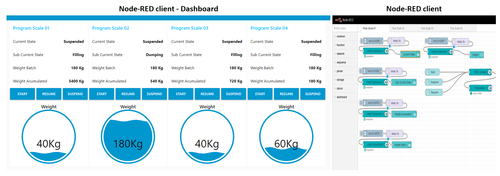

# OPC-UA-methodology
The following libraries are necessary for starting up the Python OPC-UA server and the Node-Red OPC-UA client. This simulation shows the execution of 4 continuous flow scales.

## 1. Install opcua python 
pip install opcua

## 2. Install Node.js
[http://nodered.org/docs/getting-started/installation.html](https://nodejs.org/en/download)

## 3. Install Node-Red
npm install -g --unsafe-perm node-red

## 4. Install modulo de OPCUA module 
npm install -g node-red-contrib-opcua

## 5. Install dashboard module
npm i node-red-dashboard

## 6. Server python deployment
python Server.py

## 7. Node-Red deployment
node-red

